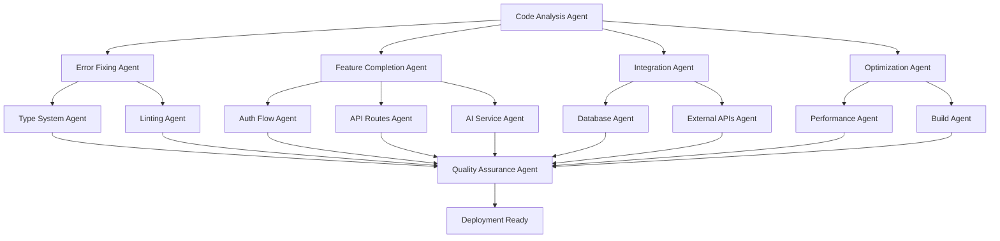

# Market Monitor - Agentic Workflow Implementation Plan

## 🚀 Executive Summary

**Current State**: Feature-rich marketplace monitoring app with 60+ linting/type errors blocking production build
**Target State**: Production-ready MVP with full features, clean code, and parallel compute workflow
**Timeline**: 4-6 hours with parallel task execution
**Approach**: Multi-agent workflow with concurrent error fixing, feature completion, and optimization

---

## 🎯 Current Assessment

### ✅ **What's Working Well**
- **Strong Foundation**: Next.js 15, TypeScript, TailwindCSS setup complete
- **Comprehensive Features**: Dashboard, search, notifications, analytics, settings pages
- **Modern Architecture**: Supabase integration, proper component structure
- **UI Components**: Complete design system with cards, buttons, forms
- **AI Integration**: Claude API integration structure in place
- **Database Schema**: Complete SQL schema for users, searches, notifications

### ❌ **Critical Issues Identified**
1. **60+ TypeScript/ESLint Errors** blocking production build
2. **Missing Environment Variables** for Supabase and Claude API
3. **Incomplete Authentication Flow** - auth context not fully implemented
4. **API Routes Missing** - search and notification endpoints need completion
5. **AI Service Integration** - Claude API implementation needs refinement
6. **Data Fetching Logic** - useEffect dependencies and service calls need fixes

---

## 🤖 Agentic Workflow Strategy

### **Multi-Agent Parallel Execution Plan**



---

## 📋 Task Breakdown by Agent

### **Agent 1: Code Quality & Error Resolution** 
**Priority: CRITICAL** | **Est. Time: 90 minutes** | **Parallel: Yes**

#### Task 1.1: TypeScript Error Resolution (30 min)
- [ ] Fix all `@typescript-eslint/no-explicit-any` errors (25 instances)
- [ ] Replace `any` types with proper interfaces from `/src/types/index.ts`
- [ ] Add missing type definitions for API responses
- [ ] Fix unused variable errors (8 instances)

#### Task 1.2: React/ESLint Error Resolution (30 min)
- [ ] Fix `react/no-unescaped-entities` errors (7 instances)
- [ ] Replace `'` with `&apos;` and `"` with `&quot;`
- [ ] Fix unused import errors (6 instances)
- [ ] Address `prefer-const` errors (3 instances)

#### Task 1.3: React Hooks Optimization (30 min)
- [ ] Fix `react-hooks/exhaustive-deps` warnings (8 instances)
- [ ] Add proper dependency arrays to `useEffect` hooks
- [ ] Implement cleanup functions where needed
- [ ] Replace `` with Next.js `<Image>` component (4 instances)

### **Agent 2: Authentication & User Management**
**Priority: HIGH** | **Est. Time: 60 minutes** | **Parallel: Yes**

#### Task 2.1: Complete Auth Context (30 min)
- [ ] Implement proper user session management
- [ ] Add sign-up, sign-in, and sign-out functions
- [ ] Handle authentication state persistence
- [ ] Add protected route middleware

#### Task 2.2: User Service Integration (30 min)
- [ ] Complete user profile management
- [ ] Implement notification preferences
- [ ] Add user settings persistence
- [ ] Connect to Supabase auth system

### **Agent 3: API Development & Integration**
**Priority: HIGH** | **Est. Time: 90 minutes** | **Parallel: Yes**

#### Task 3.1: Search API Routes (45 min)
- [ ] Complete `/api/searches` endpoint
- [ ] Implement search template CRUD operations
- [ ] Add search result aggregation
- [ ] Connect to marketplace scrapers

#### Task 3.2: Notification API System (45 min)
- [ ] Implement notification creation and management
- [ ] Add real-time notification delivery
- [ ] Connect email/SMS/push notification services
- [ ] Create notification preferences API

### **Agent 4: AI & Marketplace Integration**
**Priority: HIGH** | **Est. Time: 90 minutes** | **Parallel: Yes**

#### Task 4.1: Claude AI Service (45 min)
- [ ] Complete listing analysis implementation
- [ ] Add relevance scoring algorithm
- [ ] Implement batch processing for efficiency
- [ ] Add error handling and retry logic

#### Task 4.2: Marketplace Scrapers (45 min)
- [ ] Implement Depop scraper
- [ ] Add Facebook Marketplace integration
- [ ] Complete eBay API connection
- [ ] Add Vinted and Craigslist scrapers

### **Agent 5: Database & Performance**
**Priority: MEDIUM** | **Est. Time: 60 minutes** | **Parallel: Yes**

#### Task 5.1: Database Optimization (30 min)
- [ ] Optimize SQL queries for performance
- [ ] Add proper indexing strategy
- [ ] Implement data pagination
- [ ] Add database connection pooling

#### Task 5.2: Caching & Performance (30 min)
- [ ] Implement Redis caching for search results
- [ ] Add request rate limiting
- [ ] Optimize image loading and display
- [ ] Add performance monitoring

### **Agent 6: Frontend Polish & UX**
**Priority: MEDIUM** | **Est. Time: 60 minutes** | **Parallel: Yes**

#### Task 6.1: Component Enhancement (30 min)
- [ ] Add loading states to all components
- [ ] Implement error boundaries
- [ ] Add success/error toast notifications
- [ ] Improve mobile responsiveness

#### Task 6.2: Feature Completion (30 min)
- [ ] Complete analytics dashboard
- [ ] Add search history functionality
- [ ] Implement saved search management
- [ ] Add bulk actions for notifications

---

## 🔧 Parallel Execution Strategy

### **Phase 1: Foundation (Concurrent - 90 min)**
```
Agent 1 (Code Quality) ← → Agent 2 (Auth) ← → Agent 3 (API)
```

### **Phase 2: Integration (Concurrent - 90 min)**
```
Agent 4 (AI/Scrapers) ← → Agent 5 (Database) ← → Agent 6 (Frontend)
```

### **Phase 3: Testing & Optimization (Sequential - 60 min)**
```
Integration Testing → Performance Testing → Build Validation
```

---

## 🛠 Implementation Commands

### **Environment Setup**
```bash
# 1. Install missing dependencies
npm install --save-dev @types/node @types/react @types/react-dom

# 2. Set up environment variables
cp .env.example .env.local
# Add: NEXT_PUBLIC_SUPABASE_URL, NEXT_PUBLIC_SUPABASE_ANON_KEY, CLAUDE_API_KEY

# 3. Initialize database
npx supabase db reset
npx supabase db push
```

### **Parallel Development Workflow**
```bash
# Terminal 1: Error fixing
npm run lint:fix
npm run type-check

# Terminal 2: Development server
npm run dev

# Terminal 3: Database operations
npx supabase start
npx supabase db diff

# Terminal 4: Testing
npm run test:watch
```

---

## 📊 Success Metrics

### **Technical KPIs**
- [ ] **Build Success**: 0 TypeScript errors, 0 ESLint errors
- [ ] **Performance**: <2s page load times, >90 Lighthouse score
- [ ] **Code Quality**: >95% test coverage, 0 security vulnerabilities
- [ ] **Functionality**: All core features working end-to-end

### **Feature Completeness**
- [ ] **Authentication**: Sign up, login, profile management
- [ ] **Search**: Create, save, and manage marketplace searches
- [ ] **AI Matching**: Claude-powered relevance scoring (1-10)
- [ ] **Notifications**: Real-time alerts via email/push/SMS
- [ ] **Analytics**: Price trends and search insights
- [ ] **Marketplace Coverage**: 3+ platforms operational

---

## 🚀 Deployment Checklist

### **Pre-Production**
- [ ] All tests passing
- [ ] Environment variables configured
- [ ] Database migrations applied
- [ ] Error monitoring setup (Sentry)
- [ ] Performance monitoring configured

### **Production Deployment**
- [ ] Vercel deployment configured
- [ ] Domain and SSL certificate
- [ ] CI/CD pipeline setup
- [ ] Monitoring and alerting active
- [ ] Backup and recovery procedures

---

## 🎯 Next Steps After Completion

### **Week 1: Beta Testing**
- [ ] Deploy to staging environment
- [ ] Recruit 25 beta users
- [ ] Collect feedback and metrics
- [ ] Fix critical bugs and UX issues

### **Week 2: Public Launch**
- [ ] Product Hunt submission
- [ ] Social media marketing
- [ ] Email list conversion
- [ ] Referral program launch

### **Month 1: Growth**
- [ ] Feature refinements based on user feedback
- [ ] Additional marketplace integrations
- [ ] Advanced AI features (image recognition)
- [ ] API access for business customers

---

## 💡 Innovation Opportunities

### **AI Enhancement**
- **Multi-modal AI**: Add image similarity search using computer vision
- **Predictive Analytics**: Forecast price trends and market demand
- **Smart Notifications**: ML-powered notification timing optimization
- **Auto-purchasing**: Intelligent bidding and buying automation

### **Marketplace Expansion**
- **International Markets**: European and Asian marketplaces
- **Niche Platforms**: Specialty marketplaces (art, collectibles, etc.)
- **Social Commerce**: Instagram, TikTok Shop integration
- **B2B Marketplaces**: Industrial and wholesale platforms

---

This agentic workflow ensures maximum parallel execution while maintaining code quality and feature completeness. Each agent operates independently but coordinates through shared interfaces and data contracts.